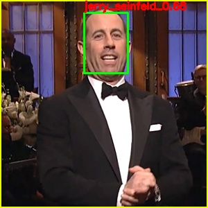

# face-recognition-mtcnn-resnet-svc

## Request
data/              
│
├── train/            
│   ├── A/           
│   │   ├── A_1.jpg
│   │   ├── A_2.jpg
│   │   └── ...
│   │
│   └── B/          
│       ├── B_1.jpg
│       ├── B_2.jpg
│       └── ...
│
└── val/             
    ├── A/
    │   ├── A_1.jpg
    │   ├── A_2.jpg
    │   └── ...
    │
    └── B/
        ├── B_1.jpg
        ├── B_2.jpg
        └── ...

Python: 3.12.3
OpenCV: 4.12.0
PyTorch: 2.2.2+cu121
Joblib: 1.5.1
NumPy: 1.26.1
Pandas: 2.3.2
Seaborn: 0.13.2
Matplotlib: 3.10.5
Pillow: 10.2.0
Scikit-learn: 1.7.1
Torchvision: 0.17.2+cu121
Facenet-pytorch: 2.6.0

## Out_val

